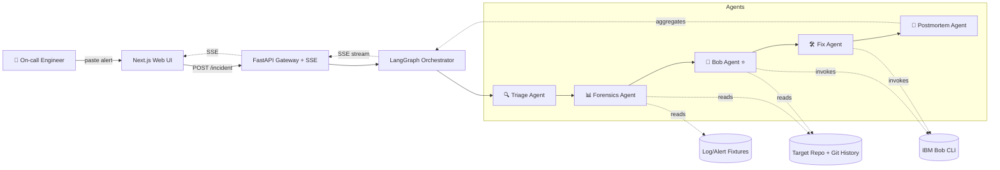

# 🔍 Sherlock — AI Incident Response Co-pilot

**Implementation Plan for IBM Bob Hackathon**

> *"From alert to fix PR in 5 minutes — your AI on-call partner that actually reads the codebase."*

---

## Table of Contents

1. [Problem Statement](#1-problem-statement)
2. [Requirements](#2-requirements)
3. [Background & Research Notes](#3-background--research-notes)
4. [Proposed Solution](#4-proposed-solution)
5. [Task Breakdown](#5-task-breakdown)
6. [Risk Mitigation](#6-risk-mitigation)
7. [Success Criteria](#7-success-criteria)
8. [Stretch Goals](#8-stretch-goals)

---

## 1. Problem Statement

Saat production incident terjadi, engineer on-call menghabiskan **rata-rata 4.4 jam MTTR (Mean Time To Resolve)** untuk siklus: parse stack trace → cari root cause di kode → reproduce → fix → write postmortem. Downtime production menelan biaya rata-rata **$5,600/menit** (Gartner).

Tools observability yang ada (Sentry AI, Datadog Watchdog, PagerDuty AIOps) hanya bisa **summarize logs** — tidak ada yang punya **code-level reasoning** dengan full repo context. Inilah gap yang Sherlock isi, dengan IBM Bob sebagai *engine* repo intelligence-nya.

**Scope 48 jam:** Proof-of-concept end-to-end — dari paste alert → multi-agent pipeline → output PR draft + postmortem.md, dengan UI realtime yang demo-able.

---

## 2. Requirements

### Functional Requirements

- **FR-1:** User dapat submit input incident (stack trace / log snippet / alert JSON) lewat web UI atau API
- **FR-2:** Sistem menjalankan 5-agent pipeline: Triage → Forensics → Bob → Fix → Postmortem
- **FR-3:** UI menampilkan progress agent secara realtime (streaming)
- **FR-4:** Output akhir mencakup: (a) root cause analysis, (b) code patch/diff, (c) postmortem markdown
- **FR-5:** IBM Bob CLI dipanggil sebagai sub-agent oleh orkestrator — bukan sekadar tool eksternal
- **FR-6:** Sistem dapat dijalankan terhadap sample repo yang disiapkan (untuk demo) maupun repo arbitrer

### Non-Functional Requirements

- **NFR-1:** Pipeline end-to-end < 5 menit pada sample case
- **NFR-2:** Setiap agent harus testable secara independen (TDD)
- **NFR-3:** Streaming response (SSE/WebSocket) untuk UX realtime
- **NFR-4:** Demo harus reproducible — ada scripted scenario + backup video

### Hackathon-Specific Requirements

- **HR-1:** IBM Bob harus terlihat sebagai komponen sentral, bukan tempelan
- **HR-2:** Multi-agent architecture dapat dijelaskan dalam 1 slide
- **HR-3:** Demo flow < 3 menit untuk presentasi juri

### Tech Stack (Confirmed)

- **Frontend:** Next.js 14 (App Router) + React + TypeScript + Tailwind CSS
- **Backend:** Python 3.11+ + FastAPI + Pydantic v2
- **Agent orchestration:** LangGraph (atau custom state machine kalau ingin lebih ringan)
- **Streaming:** Server-Sent Events (SSE) — lebih simple dari WebSocket untuk one-way
- **Bob integration:** Subprocess wrapper memanggil Bob CLI dengan structured I/O
- **Sample repo:** Akan disiapkan — repo Python/Node.js kecil dengan 2-3 realistic bug yang sengaja di-inject

---

## 3. Background & Research Notes

### Tentang IBM Bob (Asumsi berdasarkan brief hackathon)

- AI dev partner dengan **full repository context awareness**
- Tersedia sebagai CLI yang bisa dipanggil dari script lain
- Dapat di-prompt dengan tugas spesifik (misal: "explain why function X exists", "generate fix for this bug")
- Output Bob perlu di-parse — jadi konstruksi prompt harus deterministic dan output structured (JSON/markdown sections)

### Multi-Agent Pattern: Why LangGraph

- State-based graph cocok untuk pipeline incident response (state mengalir antar agent)
- Built-in streaming support untuk SSE
- Mudah di-mock untuk testing
- Alternatif: orchestrator manual dengan `asyncio` + Pydantic state — lebih ringan tapi perlu lebih banyak kode glue

### Competitor Landscape (Confirm Originality)

| Tool | Logs | Repo Context | Code Fix | Postmortem Auto |
|---|---|---|---|---|
| Sentry AI | ✅ | ❌ | ❌ | Partial |
| Datadog Watchdog | ✅ | ❌ | ❌ | ❌ |
| PagerDuty AIOps | ✅ | ❌ | ❌ | ❌ |
| GitHub Copilot Workspace | ❌ | ✅ | ✅ | ❌ |
| **Sherlock (kita)** | ✅ | ✅ (via Bob) | ✅ | ✅ |

Sherlock = posisi **unik di intersection antara observability dan code intelligence**.

---

## 4. Proposed Solution

### 4.1 High-Level Architecture



### 4.2 Agent Responsibilities

| Agent | Input | Output | Bob Used? |
|---|---|---|---|
| **Triage** | Raw alert/log | `{severity, service, error_type, summary}` | No (pure logic + small LLM call) |
| **Forensics** | Triage output | `{recent_commits, blame_info, related_logs}` | No (git CLI + log parsing) |
| **Bob** ⭐ | Triage + Forensics | `{root_cause_hypothesis, suspect_files, reasoning}` | **Yes — full repo context** |
| **Fix** | All previous state | `{patch_diff, test_diff, pr_description}` | **Yes — code generation** |
| **Postmortem** | Full pipeline state | `postmortem.md` (timeline, RCA, action items) | Optional (Bob untuk polish prose) |

### 4.3 State Schema (Pydantic)

```python
class IncidentState(BaseModel):
    incident_id: str
    raw_input: str
    triage: Optional[TriageResult] = None
    forensics: Optional[ForensicsResult] = None
    root_cause: Optional[RootCauseAnalysis] = None
    fix: Optional[FixProposal] = None
    postmortem: Optional[str] = None
    agent_events: list[AgentEvent] = []  # for streaming
```

### 4.4 Bob CLI Integration Pattern

```python
# Conceptual wrapper
async def call_bob(prompt: str, repo_path: str, output_schema: type[BaseModel]) -> BaseModel:
    structured_prompt = render_template(prompt, output_format=output_schema.model_json_schema())
    result = await asyncio.create_subprocess_exec(
        "bob", "ask", "--repo", repo_path, "--format", "json",
        stdin=PIPE, stdout=PIPE, stderr=PIPE
    )
    stdout, _ = await result.communicate(structured_prompt.encode())
    return output_schema.model_validate_json(stdout)
```

> **Note:** Implementasi exact tergantung Bob CLI flags yang tersedia saat hackathon dimulai. Wrapper akan diadaptasi pada Task 3.

### 4.5 Demo Scenario (untuk presentasi juri)

1. **Setup:** Sample repo `flaky-shop` (Node.js + Express e-commerce mini) sudah di-clone, ada bug di `src/cart/checkout.ts` (race condition pada inventory decrement)
2. **Trigger:** User paste Sentry-style error di UI: `TypeError: Cannot read property 'quantity' of undefined at decrementInventory (checkout.ts:42)`
3. **Live demo (3 menit):**
   - 0:00 — Submit alert
   - 0:15 — Triage card muncul: "HIGH severity, checkout service, null pointer"
   - 0:30 — Forensics card: "3 recent commits di checkout.ts, last by @alice 2 days ago"
   - 1:00 — Bob agent thinking... → Root cause card: "Inventory di-fetch async tapi decrement tidak await — race condition"
   - 1:45 — Fix agent: tampilkan diff dengan `await` ditambahkan + unit test baru
   - 2:30 — Postmortem.md ter-render dengan timeline + action items
4. **Closing:** "Without Bob = 4 jam debugging. With Sherlock = 3 menit. Bob's repo context is the differentiator."

---

## 5. Task Breakdown

> Each task ends with a working, demoable increment. TDD-first untuk core logic (agents, state). Frontend test minimal untuk hackathon (manual + 1-2 happy-path Playwright).

### Task 1: Project Scaffolding & Monorepo Setup

**Objective:** Buat struktur monorepo dengan `frontend/` (Next.js) + `backend/` (FastAPI), dengan dev script yang bisa jalan kedua server bersamaan.

**Implementation Guidance:**

- Root: `pnpm` workspace atau plain folder structure
- Backend: `poetry` atau `uv` untuk dependency mgmt; FastAPI + uvicorn; setup `/health` endpoint; CORS configured untuk localhost:3000
- Frontend: `npx create-next-app@latest` dengan TS + Tailwind + App Router; satu page yang fetch `/health` dari backend
- Add `Makefile` atau `npm run dev:all` yang start kedua server (concurrently)
- `.env.example`, `.gitignore`, README skeleton

**Test Requirements:**

- Backend: pytest test untuk `/health` returns 200
- Frontend: render check pada landing page (Vitest/Playwright minimal)

**Demo:** Run `make dev`, buka `http://localhost:3000`, lihat tulisan "Sherlock — Backend status: ✅ Healthy" dengan data fetched dari FastAPI.

---

### Task 2: Sample Repo + Alert Fixtures

**Objective:** Siapkan target repo (`fixtures/flaky-shop`) dengan 2-3 realistic bug + corresponding alert fixtures sebagai test data.

**Implementation Guidance:**

- Clone/buat repo Node.js kecil: 5-10 file, simulasi e-commerce checkout
- Inject bug terkontrol: (a) async/await race condition, (b) null pointer, (c) off-by-one
- Buat `fixtures/alerts/` dengan JSON: `alert_race_condition.json`, `alert_npe.json`, dengan struktur mirip Sentry payload
- Tambahkan `fixtures/expected_outputs/` — golden file untuk regression test

**Test Requirements:**

- Validate fixtures schema (Pydantic)
- Smoke test: bug benar-benar reproducible (jalankan repo, dapat error yang sesuai)

**Demo:** Run `pytest backend/tests/fixtures_test.py` — semua fixture pass schema validation. Bisa juga `cd fixtures/flaky-shop && npm test` menampilkan failing test untuk bug yang sengaja di-inject.

---

### Task 3: Bob CLI Wrapper Service

**Objective:** Python module `backend/bob_client.py` yang membungkus Bob CLI dengan async subprocess, structured I/O, error handling, dan timeout.

**Implementation Guidance:**

- Function signature: `async def ask_bob(prompt: str, repo_path: str, schema: type[T]) -> T`
- Subprocess dengan timeout 60s default; capture stderr untuk debugging
- Retry logic: 1 retry pada parse failure
- Mock mode: kalau `BOB_MOCK=1`, return canned responses dari `fixtures/bob_responses/` — penting untuk testing tanpa quota Bob
- Logging structured (correlation ID per call)
- API endpoint `POST /api/bob/ask` untuk smoke test manual

**Test Requirements:**

- Unit test dengan mock subprocess (pytest + monkeypatch)
- Integration test (skipped by default, run dengan `--bob-real` flag)

**Demo:** `curl -X POST localhost:8000/api/bob/ask -d '{"prompt":"Explain main.py","repo":"fixtures/flaky-shop"}'` → return JSON dengan jawaban Bob (atau mock response).

---

### Task 4: Triage Agent + Tests

**Objective:** Implementasi agent pertama yang men-classify input alert.

**Implementation Guidance:**

- File: `backend/agents/triage.py`
- Pure function: `triage(raw_alert: str) -> TriageResult`
- Logic combo: regex pattern matching (severity keywords) + small LLM call optional untuk classify error type
- TriageResult: `{severity: enum, service: str, error_type: str, summary: str, confidence: float}`
- Tidak panggil Bob — keep it light & fast

**Test Requirements:**

- TDD: tulis test dulu untuk 3 fixture alerts, baru implement
- Edge case: malformed input, missing stack trace, multi-line logs

**Demo:** API endpoint `POST /api/agents/triage` accept raw alert, return TriageResult JSON. Tampilkan di UI sebagai "first agent card" dengan severity badge.

---

### Task 5: Agent Orchestration Framework

**Objective:** State machine yang menjalankan agents berurutan dengan streaming progress events.

**Implementation Guidance:**

- Pakai LangGraph: nodes = agents, edges = sequential dengan conditional skip
- Atau custom: `Pipeline` class dengan `async def run(state) -> AsyncIterator[Event]`
- Event types: `AgentStarted`, `AgentProgress`, `AgentCompleted`, `AgentFailed`, `PipelineCompleted`
- Endpoint: `GET /api/incidents/{id}/stream` (SSE) — emits events sebagai mereka terjadi
- Untuk Task 5 cukup integrate Triage saja sebagai single-node pipeline

**Test Requirements:**

- Unit test pipeline dengan mock agent
- SSE endpoint test dengan async client

**Demo:** Submit alert → SSE stream emit `AgentStarted(triage)` → `AgentCompleted(triage, result)` → `PipelineCompleted`. Bisa diverifikasi via `curl --no-buffer http://localhost:8000/api/incidents/abc/stream`.

---

### Task 6: Forensics Agent

**Objective:** Agent yang gather context dari git history + log fixtures.

**Implementation Guidance:**

- File: `backend/agents/forensics.py`
- Operasi: `git log --oneline -20 -- <suspect_path>`, `git blame -L`, parse log fixtures untuk error timestamp window
- Output: `ForensicsResult{recent_commits, blame_info, log_excerpts}`
- Pakai `gitpython` atau plain subprocess
- Tidak panggil Bob

**Test Requirements:**

- Unit test dengan mock git repo (atau actual fixtures/flaky-shop)
- Test ketika repo path invalid, ketika no commits found

**Demo:** Run pipeline → 2 agent cards muncul realtime: Triage + Forensics. Forensics card menampilkan list recent commits dengan author + message.

---

### Task 7: Bob Agent (Hero Agent)

**Objective:** Agent yang invoke Bob CLI untuk hypothesize root cause dengan full repo context.

**Implementation Guidance:**

- File: `backend/agents/bob_analyst.py`
- Konstruksi prompt: include triage summary + forensics commits + minta Bob output JSON dengan `{root_cause, suspect_files: [{path, lineno, reason}], reasoning_chain}`
- Pakai wrapper dari Task 3
- Fallback strategy: jika Bob fail/timeout, return graceful degraded response (jangan crash pipeline)
- Logging: simpan prompt + response untuk debug

**Test Requirements:**

- Unit test dengan mock Bob (dari fixtures/bob_responses/)
- Integration test (real Bob, optional, manual run)

**Demo:** Full pipeline (Triage → Forensics → Bob) menghasilkan root cause card di UI dengan reasoning text yang reference actual file/line dari sample repo. **Ini moment "wow" pertama** — Bob menjelaskan kenapa bug terjadi dengan code-level detail.

---

### Task 8: Fix Agent

**Objective:** Agent yang generate code patch + regression test berdasarkan root cause.

**Implementation Guidance:**

- File: `backend/agents/fix.py`
- Invoke Bob: prompt include suspect_files + reasoning, request output `{patch_unified_diff, test_code, pr_title, pr_body}`
- Validate diff: parse-able sebagai unified diff (gunakan `unidiff` lib)
- Optional bonus: apply patch ke working tree, run sample repo's test suite, capture result
- Output ready untuk PR submission (tidak harus auto-submit; cukup display)

**Test Requirements:**

- Mock Bob test dengan canned diff
- Diff parse validity test
- Optional: end-to-end "patch applies cleanly" test

**Demo:** Pipeline lengkap sampai Fix → UI tampilkan diff dengan syntax highlighting, dengan PR title & body siap di-copy. Bonus: button "Verify patch" yang apply diff dan run tests, return ✅/❌.

---

### Task 9: Postmortem Agent

**Objective:** Agent yang aggregate seluruh state pipeline jadi postmortem markdown profesional.

**Implementation Guidance:**

- File: `backend/agents/postmortem.py`
- Template-based dengan Jinja2: sections = Summary, Timeline, Root Cause, Resolution, Action Items, Lessons Learned
- Optional: invoke Bob untuk polish prose section (executive summary)
- Output: string markdown valid + saved ke `outputs/{incident_id}/postmortem.md`

**Test Requirements:**

- Unit test rendering template dengan full state fixture
- Markdown validity check (no broken links/headings)

**Demo:** Pipeline lengkap → user dapat preview rendered markdown di UI (pakai `react-markdown`), download button → file `.md` ter-download.

---

### Task 10: Frontend MVP — Incident Input + Agent Timeline

**Objective:** Next.js page utama dengan form input + realtime agent progress visualization.

**Implementation Guidance:**

- Page: `app/incidents/new/page.tsx` (form), `app/incidents/[id]/page.tsx` (live view)
- Form: textarea untuk paste alert, repo path selector (dropdown dari sample repos), submit button
- Live view: connect ke SSE endpoint dengan `EventSource`, render agent cards yang update sequentially
- Loading states: skeleton pulsing untuk agent yang sedang running
- Status indicators: pending (gray), running (blue pulse), completed (green), failed (red)
- Tailwind: clean dark theme — terlihat "ops-grade"

**Test Requirements:**

- Manual smoke test
- 1 Playwright test: submit form → see all 5 agent cards muncul

**Demo:** End-to-end UX: paste alert di browser, klik submit, lihat 5 agent card muncul satu per satu dengan animation. **Ini main demo moment.**

---

### Task 11: Frontend Polish — Output Viewers

**Objective:** Komponen untuk display output kompleks: code diff, markdown, structured analysis.

**Implementation Guidance:**

- `<DiffViewer>` pakai `react-diff-viewer-continued` atau custom dengan `prismjs`
- `<MarkdownViewer>` pakai `react-markdown` + `remark-gfm` + syntax highlighting
- `<RootCauseCard>` — structured display dengan suspect file links, reasoning chain expandable
- Copy-to-clipboard buttons di setiap output
- Download button untuk postmortem.md
- Final summary card: "Sherlock saved you ~4 hours" (ROI message untuk juri)

**Test Requirements:**

- Visual regression manual
- Component snapshot tests (optional)

**Demo:** Full polished UX. Demo flow ready untuk juri. Bisa screenshot setiap step untuk slide deck.

---

### Task 12: Demo Prep + Documentation + Wiring

**Objective:** Final integration polish + demo materials + Bob usage documentation.

**Implementation Guidance:**

- **README.md** — quickstart, architecture diagram, Bob role explanation, demo script
- **Demo script** — exact narration untuk 3 menit pitch
- **Backup demo video** — record happy-path run (kalau live demo glitch)
- **Bob usage log** — dokumentasi semua tempat Bob dipanggil (build-time + runtime), screenshot Bob CLI session yang dipakai saat develop (untuk bukti ke juri)
- **Slide deck** (3-5 slide): Problem → Solution → Architecture → Live demo → Bob's role
- Final E2E test: jalankan pipeline pada 3 different alerts (3 bug fixtures), pastikan semuanya jalan
- Deploy preview (optional: Vercel + fly.io / Railway untuk backend) — kalau waktu cukup

**Test Requirements:**

- Full E2E happy path × 3 scenarios = green
- README instructions diikuti dari nol di mesin baru → run berhasil

**Demo:** **The full thing.** Anyone bisa clone repo, run `make dev`, ikuti README, dan dapat run demo sendiri. Slide deck + video backup siap untuk presentasi juri.

---

## 6. Risk Mitigation

| Risk | Probability | Mitigation |
|---|---|---|
| Bob CLI quota habis di tengah build | Medium | `BOB_MOCK=1` mode dengan canned responses; hemat quota untuk hari 2 |
| Bob output tidak structured / tidak parse-able | High | Defensive parsing, retry, prompt engineering iterasi awal di Task 3 |
| Live demo glitch saat presentasi | Medium | Backup recorded video; happy-path scripted dengan fixture stabil |
| Scope creep di frontend (terlalu cantik) | High | Tailwind only, no custom design system, prioritas substance > polish |
| Multi-agent debugging hard | Medium | Verbose logging + correlation IDs sejak Task 5 |
| Tim missed deadline pada feature X | High | Task 1-9 = wajib (backend MVP), Task 10-12 = polish (boleh degraded) |

---

## 7. Success Criteria

- ✅ Pipeline end-to-end jalan untuk minimal 1 bug fixture
- ✅ UI menampilkan 5 agent cards realtime
- ✅ Output postmortem.md valid markdown, dapat di-render
- ✅ Output code diff valid, applicable
- ✅ Demo 3 menit lancar tanpa improvisasi
- ✅ Bob terdokumentasi sebagai komponen sentral (build-time + runtime)
- ✅ Public repo dengan README jelas

---

## 8. Stretch Goals

Kalau waktu sisa setelah Task 1-12:

- 🎯 Auto-create GitHub PR via API (real PR di sample repo)
- 🎯 Slack notification integration ("Sherlock found root cause for INC-123")
- 🎯 Multi-incident dashboard dengan history
- 🎯 "Replay mode" — load past incident, re-run pipeline dengan model improvement
- 🎯 Comparison metric: "Without Sherlock baseline vs With Sherlock" — A/B style data viz

---

## Appendix: Project Structure (Target)

```
hackathon/
├── README.md
├── SHERLOCK_IMPLEMENTATION_PLAN.md   ← (this file)
├── ibm_bob_hackathon.md
├── Makefile
├── docker-compose.yml                 (optional)
│
├── frontend/                          # Next.js 14 + TS + Tailwind
│   ├── app/
│   │   ├── page.tsx                   (landing / submit form)
│   │   ├── incidents/
│   │   │   ├── new/page.tsx
│   │   │   └── [id]/page.tsx          (live agent timeline)
│   │   └── layout.tsx
│   ├── components/
│   │   ├── AgentCard.tsx
│   │   ├── DiffViewer.tsx
│   │   ├── MarkdownViewer.tsx
│   │   └── RootCauseCard.tsx
│   ├── lib/
│   │   ├── api.ts                     (FastAPI client)
│   │   └── sse.ts                     (EventSource hook)
│   └── package.json
│
├── backend/                           # Python 3.11 + FastAPI
│   ├── app/
│   │   ├── main.py                    (FastAPI app, routes)
│   │   ├── models/
│   │   │   └── state.py               (Pydantic schemas)
│   │   ├── agents/
│   │   │   ├── triage.py
│   │   │   ├── forensics.py
│   │   │   ├── bob_analyst.py         ⭐
│   │   │   ├── fix.py
│   │   │   └── postmortem.py
│   │   ├── orchestrator/
│   │   │   ├── pipeline.py            (LangGraph definition)
│   │   │   └── events.py
│   │   ├── bob_client.py              (Bob CLI wrapper)
│   │   └── config.py
│   ├── tests/
│   │   ├── agents/
│   │   ├── fixtures_test.py
│   │   └── integration_test.py
│   └── pyproject.toml
│
├── fixtures/
│   ├── flaky-shop/                    (sample buggy repo)
│   ├── alerts/
│   │   ├── alert_race_condition.json
│   │   ├── alert_npe.json
│   │   └── alert_off_by_one.json
│   ├── bob_responses/                 (canned mock responses)
│   └── expected_outputs/
│
└── docs/
    ├── DEMO_SCRIPT.md
    ├── BOB_USAGE_LOG.md
    └── ARCHITECTURE.md
```

---

**Status:** Ready to execute. Approved on 2026-05-15.
